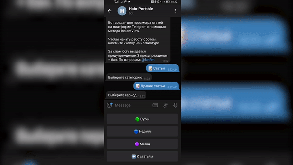
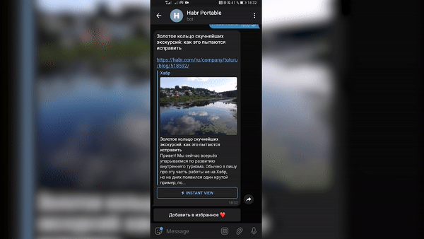
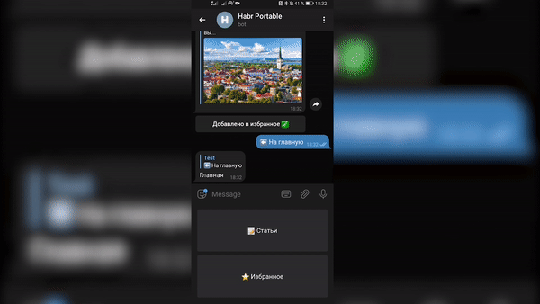

# Habr Bot 

-----

## Описание

Бот для чтения публикаций с портала habr.com при помощи telegram.

## 🗓 Выбор временного промежутка 

## 🚀 Просмотр выбранной публикации через InstantView

## ⭐️ Добавление публикации в избранное

## 🗑 Удаление из избранного

